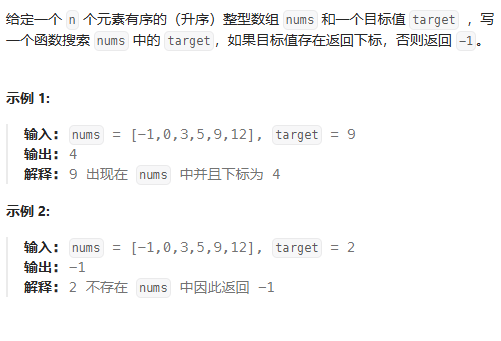

## 查找数组中的元素（topic704）


###  使用到的知识点

- 二叉树查找法：使用一前一后两个指针，通过对两个指针求中间值，再进行比较即可得到哪一边较大。重复上述方法即可求得一个数组中最小数和最大数。
- 适用题目：在元素有序（升序/降序列）的数组中查找某个元素
- 注意事项：遍历结束的条件；middle元素的选择

```c++
class Solution_mode2 {
public:
    int search(vector<int>& nums, int target) {
        int left=0,right=nums.size()-1;
       while(left<=right)
       {
            int middle=left+(right-left)/2;
            if(target<nums[middle])
            {
                right=middle-1;
            }else if(target>nums[middle])
            {
                left=middle+1;
            }else if(target==nums[middle]){return middle;}
       }
       return  -1;
    }
};

```

